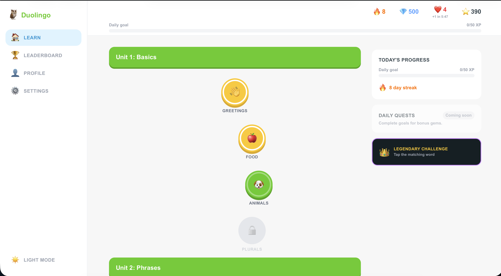
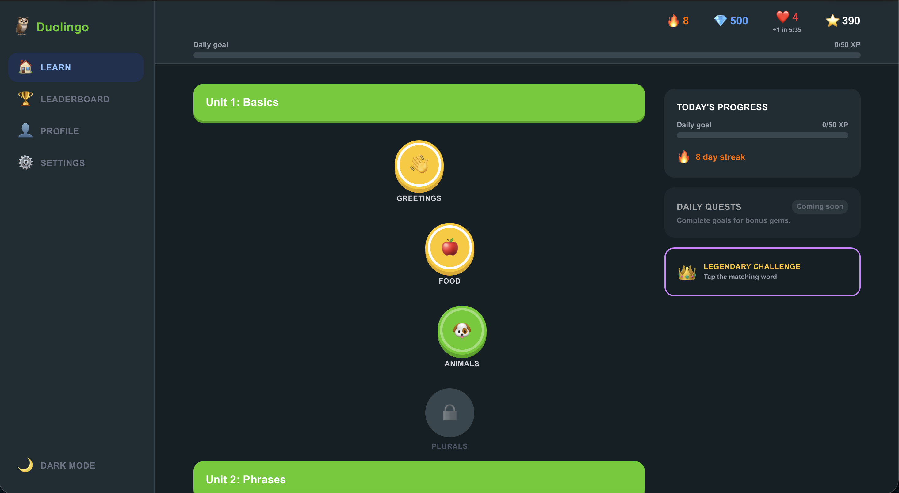
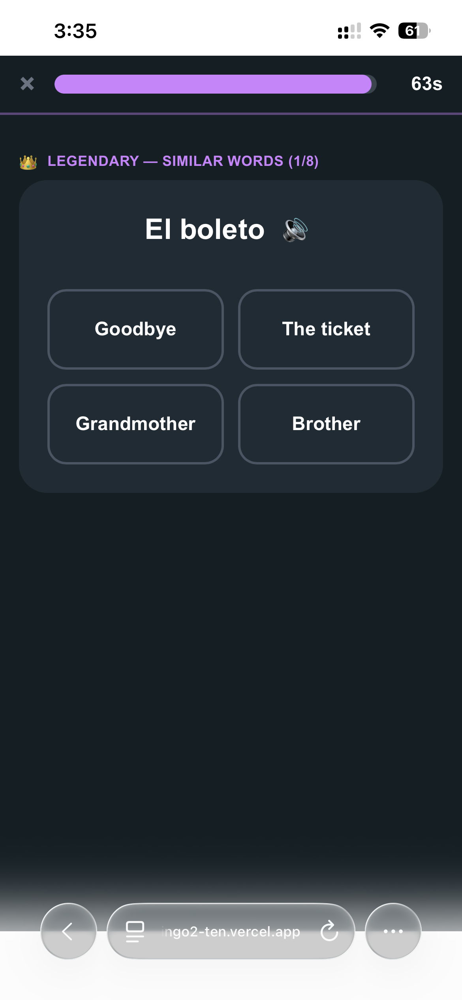
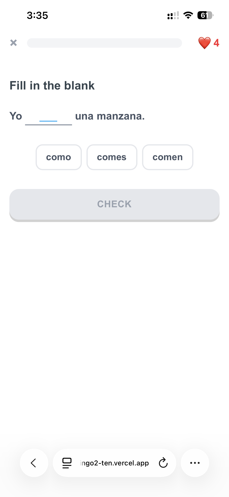
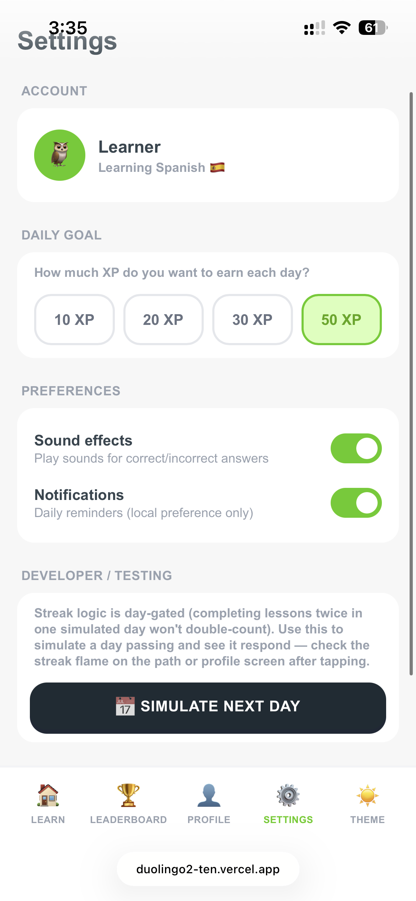

# Duolingo Clone — SDE Fullstack Assignment

A full-stack Duolingo clone built with Next.js/TypeScript and a FastAPI/SQLite backend, closely matching both the visual design and gamification mechanics of the real app. It features a locked/unlocked skill-tree learning path, a lesson player with all five exercise types (multiple choice, translate/tap-the-words, match pairs, fill in the blank, type-the-answer) with immediate feedback, hearts that regenerate over real elapsed time, XP and a genuinely day-gated streak system, and skill progression that all persists per-user in the database. Beyond the core requirements, it includes real (not mocked) bonus systems: a live-ranked leaderboard, a condition-based achievements system, dark mode, a fully responsive mobile-to-desktop layout, synthesized in-browser sound effects and text-to-speech, and a timed "Legendary" challenge mode pulling vocabulary dynamically from the whole seeded course — with the remaining explicitly-permitted sections (speech recognition, subscriptions, friends, multiple languages, real auth) present as clearly labeled placeholders.

| | |
|---|---|
| **GitHub repo** | [pjay24/Duolingo-Web-App-clone-](https://github.com/pjay24/Duolingo-Web-App-clone-) |
| **Live app** | [duolingo2-ten.vercel.app](https://duolingo2-ten.vercel.app/) |
| **Video walkthrough** | [`docs/walkthrough.mp4`](./docs/walkthrough.mp4) |

---

## Screenshots

| Learning Path (Light) | Learning Path (Dark) |
|---|---|
|  |  |

| Legendary Challenge | Lesson Player (Fill in the Blank) |
|---|---|
|  |  |

| Settings — Developer/Testing (streak day-logic testable from the UI) |
|---|
|  |

---

## Tech Stack

| Layer | Choice |
|---|---|
| Frontend | Next.js 16 (App Router), TypeScript, Tailwind CSS v4 |
| Backend | Python, FastAPI, SQLAlchemy ORM |
| Database | SQLite |
| Audio | Web Audio API (synthesized SFX) + browser `SpeechSynthesis` (TTS) — no files, no API keys |

---

## Architecture Overview

```
duolingo-clone/
├── frontend/
│   ├── app/                 One route folder per screen: / , /lesson/[skillId] , /legendary ,
│   │                         /leaderboard , /profile , /settings
│   ├── components/           Screens + exercises/ (one component per exercise type) + modals/nav/providers
│   └── lib/                  api.ts (typed fetch wrapper), types, sound.ts, speech.ts
└── backend/
    └── app/
        ├── main.py            All routes + game logic (heart regen, streak, XP, achievements)
        ├── models.py           SQLAlchemy models — schema source of truth
        ├── database.py         SQLite engine/session
        └── seed.py             One-time idempotent seed script
```

**Request flow:** each route is a Next.js server component that fetches fresh state from FastAPI (`cache: "no-store"`) and hands it to a client component for interactivity. No client-side global store — the database is the single source of truth, so a page refresh always shows exactly what's persisted.

**Auth:** none, per the assignment's explicit allowance. A hardcoded `USER_ID = 1` is used on every route. Two extra seeded users (`Maria`, `Sam`) exist to populate a non-trivial leaderboard.

---

## Database Schema

```
courses ──< units ──< skills ──< lessons ──< exercises

users ──< user_skill_progress >── skills
users ──< lesson_attempts
users ──< user_achievements >── achievements
```

| Table | Purpose | Key Columns |
|---|---|---|
| `users` | The learner + seeded competitors | `id`, `name`, `xp_total`, `gems`, `hearts`, `last_heart_lost_at`, `streak_count`, `last_active_date`, `daily_xp_goal` |
| `courses` | A language course (1 seeded: Spanish) | `id`, `title`, `language_code` |
| `units` | Groups of skills (e.g. "Unit 1: Basics") | `id`, `course_id` (FK), `title`, `order_index` |
| `skills` | One path node (e.g. "Greetings") | `id`, `unit_id` (FK), `title`, `icon`, `order_index`, `max_crowns` |
| `lessons` | A lesson within a skill | `id`, `skill_id` (FK), `order_index` |
| `exercises` | One question | `id`, `lesson_id` (FK), `order_index`, `type`, `prompt`, `data` (JSON), `correct_answer` (JSON) |
| `user_skill_progress` | Per-user skill progress (join table) | `user_id` (FK), `skill_id` (FK), `crowns_earned`, `status` |
| `lesson_attempts` | Append-only log of completions | `user_id` (FK), `lesson_id` (FK, nullable), `xp_earned`, `hearts_lost`, `passed`, `completed_at` |
| `achievements` | Badge definitions (static catalog) | `id`, `code`, `title`, `description`, `icon` |
| `user_achievements` | Which badges a user earned (join table) | `user_id` (FK), `achievement_id` (FK), `earned_at` |

**Why JSON columns on `exercises`:** each of the 5 exercise types needs a different data shape (e.g. `multiple_choice` → `{"options":[...]}`; `match_pairs` → `{"pairs":[{"left","right"}]}`). One flexible JSON column per field avoids five separate exercise tables and means a 6th exercise type later needs zero migrations.

**Why `lesson_attempts` is append-only:** `xp_today` (the daily-goal bar) is summed live from attempts completed "today," so it reflects real activity rather than a separately-tracked counter that could drift.

---

## API Overview

All routes prefixed `/api`, no auth headers.

| Method | Route | Purpose |
|---|---|---|
| `GET` | `/path` | Skill tree + user stats (applies heart regen, computes `xp_today`) |
| `GET` | `/skills/{id}/lesson` | Exercises for a skill's lesson (`correct_answer` withheld) |
| `POST` | `/lessons/{id}/answer` | Grade one answer; type-specific comparison; deducts a heart if wrong |
| `POST` | `/lessons/{id}/complete` | Award XP, update streak, unlock next skill, check achievements |
| `GET` | `/profile` | Stats + earned/locked achievements |
| `GET` | `/leaderboard` | All users, live `ORDER BY xp_total DESC` |
| `POST` | `/hearts/refill` | Mocked instant refill |
| `POST` | `/settings/daily-goal` | Update daily XP goal |
| `GET` | `/legendary/challenge` | Generates 8 rounds from all seeded vocab pairs |
| `POST` | `/legendary/answer` | Grade one Legendary round |
| `POST` | `/legendary/complete` | 30 XP only if the run was perfect |
| `POST` | `/debug/advance-day` | Testing hook — simulates a day passing for streak logic |
| `POST` | `/debug/reset-day` | Resets the simulated date back to real "today" |

---

## Setup Instructions

### Backend
```bash
cd backend
python3 -m venv venv
source venv/bin/activate        # Windows: venv\Scripts\activate
pip install -r requirements.txt
python -m app.seed              # one-time, idempotent
uvicorn app.main:app --reload --port 8000
```
Runs at `http://127.0.0.1:8000` (interactive docs at `/docs`).

### Frontend
```bash
cd frontend
npm install
echo "NEXT_PUBLIC_API_URL=http://127.0.0.1:8000" > .env.local
npm run dev
```
Runs at `http://localhost:3000`.

### Deployment
- **Backend** (Render): root = `backend/`, start command `uvicorn app.main:app --host 0.0.0.0 --port $PORT`, needs a persistent disk for SQLite to survive redeploys.
- **Frontend** (Vercel): root = `frontend/`, env var `NEXT_PUBLIC_API_URL` = your deployed backend URL.

---

## Requirements Checklist

Every assignment requirement, mapped to what was built.

### Core Features (Must Have)

| Requirement | Status | Where |
|---|---|---|
| Visual path/tree, lock → available → completed states | ✅ | `SkillNodeButton.tsx` |
| Progress rings/crowns per skill | ✅ | SVG ring in `SkillNodeButton.tsx` |
| Top bar: streak, XP, hearts, gems | ✅ | `TopBar.tsx` |
| Multiple choice exercise | ✅ | `exercises/MultipleChoiceExercise.tsx` |
| Translate / word-bank (tap-the-words) | ✅ | `exercises/TranslateTapExercise.tsx` |
| Match pairs | ✅ | `exercises/MatchPairsExercise.tsx` |
| Fill in the blank | ✅ | `exercises/FillBlankExercise.tsx` |
| Type the answer | ✅ | `exercises/TypeAnswerExercise.tsx` |
| Immediate correct/incorrect feedback bar | ✅ | `FeedbackBar.tsx` |
| Lesson progress bar | ✅ | `LessonProgressBar.tsx` |
| Hearts lose on wrong answer; failure handled | ✅ | `/lessons/{id}/answer` + `OutOfHeartsModal.tsx` |
| Award XP + mark skill progress on completion | ✅ | `/lessons/{id}/complete` |
| Streak increments daily (testable) | ✅ | day-gated logic + **testable directly in the UI**: Settings → Developer/Testing → "Simulate Next Day" |
| XP totals + leaderboard | ✅ | `/leaderboard`, live-ranked |
| Hearts regen over time / mocked refill | ✅ | `apply_heart_regen()` (real, time-based) + `/hearts/refill` |
| Daily goal indicator | ✅ | `TopBar.tsx` progress bar |
| All progress persists per user | ✅ | SQLite, no client-side store |
| Course content stored in DB + seeded | ✅ | `seed.py` — 1 course, 2 units, 7 skills, 35 exercises |
| Learner profile with stats + achievements | ✅ | `ProfileScreen.tsx` |
| Playful UI with mascot flourishes | ✅ | 🦉 throughout |
| Animated lesson feedback | ✅ | `FeedbackBar.tsx`, confetti on complete |
| Modals + toasts + celebratory states | ✅ | `LessonCompleteModal`, `OutOfHeartsModal`, `ToastProvider` |
| Settings placeholders | ✅ | `SettingsScreen.tsx` |

### Bonus (Optional)

| Item | Status | Where |
|---|---|---|
| Audio for exercises | ✅ | Synthesized SFX (`sound.ts`) + TTS (`speech.ts`) |
| Achievements / badges system | ✅ | Real conditions: 100 XP, 30-day streak; idempotent awarding |
| Real functioning leaderboard | ✅ | Live `ORDER BY xp_total DESC`, not static |
| Timed "Legendary" challenge mode | ✅ | `LegendaryChallengePlayer.tsx` — countdown, one mistake ends the run, bonus XP on a perfect clear |
| Dark mode | ✅ | `ThemeProvider.tsx`, app-wide |
| Responsive design (mobile/tablet/desktop) | ✅ | Bottom nav (mobile) → sidebar nav (desktop) |

### Mocked / Placeholder (explicitly permitted)

| Section | Treatment |
|---|---|
| Speech recognition / pronunciation | "Coming Soon" card in Settings (playback TTS *is* real — only recognition is mocked) |
| Super subscription / IAP | Gems are static/seeded, never spent; "Coming Soon" card |
| Friends / social | "Coming Soon" tab on Leaderboard; live Global leaderboard covers the social angle |
| Multiple languages | One seeded course (Spanish); "Change" button is a placeholder |
| Real authentication | Hardcoded `USER_ID = 1`; "Sign in with Google" row is a placeholder |

### Testing streak logic without waiting real days

Go to **Settings → Developer/Testing → "Simulate Next Day"**. This calls `POST /api/debug/advance-day`, advances the app's internal simulated date by one day, and shows a toast confirming it. Complete a lesson before and after tapping it to see: (a) completing multiple lessons on the *same* simulated day does not double-increment the streak, and (b) crossing into a new simulated day does. A "reset" is also available via `POST /api/debug/reset-day` (or just restart the backend — the offset is in-memory, not persisted).

---

## Key Design Decisions & Simplifications

- **One lesson per skill.** Completing it awards all 5 crowns in one shot rather than building crowns across multiple attempts — keeps seeded content small per the assignment's own guidance. The unlock mechanism supports multiple lessons per skill unchanged if more were added later.
- **Flat XP per lesson** (15 XP normal, 30 for a perfect Legendary run) — not scaled by accuracy. `correct_count`/`hearts_lost` are captured on `lesson_attempts` but not currently used to scale reward.
- **No hard lesson failure.** Running out of hearts offers a free "practice to refill" rather than a dead end, matching "failure handled" without being punitive.
- **Hearts regen is real, not a background job.** `last_heart_lost_at` + `apply_heart_regen()`, computed on-demand from real elapsed time whenever hearts are read.
- **Gems are cosmetic-only** — seeded to 500, never spent, per the assignment's explicit "gems can be mocked" allowance.

---
